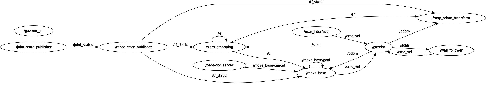
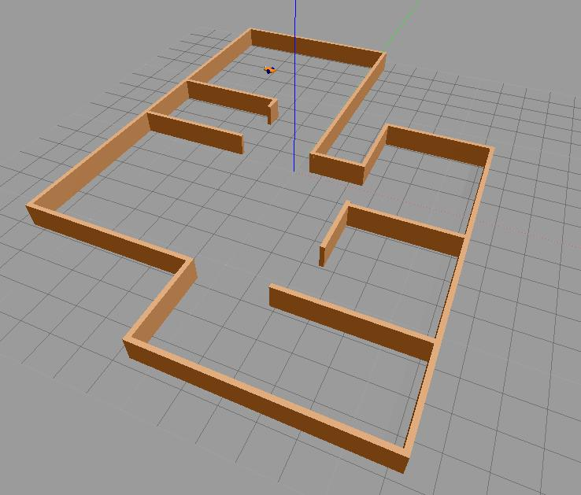
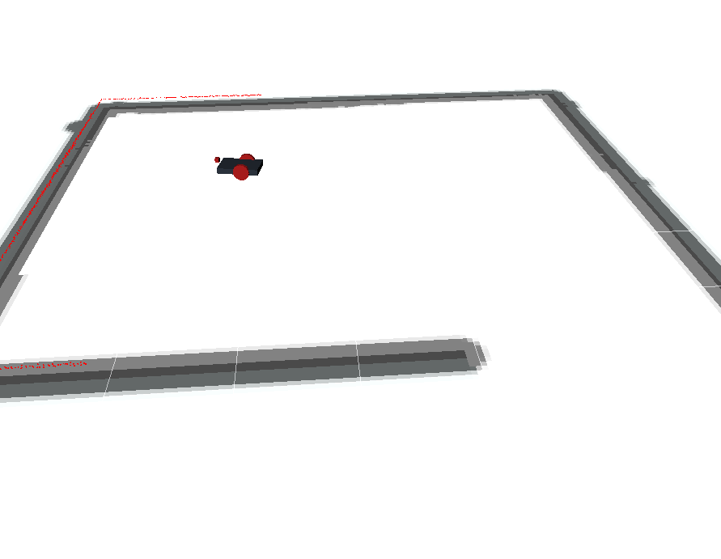
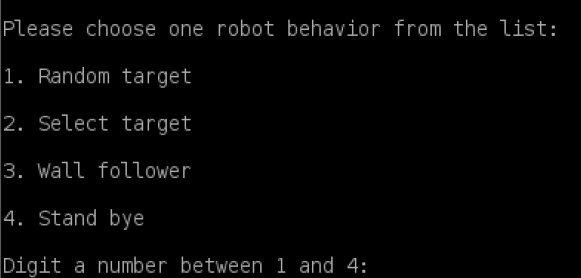

## Overview

This package was developed as a solution of the final assignment of the Research Track I course of Robotics Engineering held by Professor Recchiuto Carmine. The package allows a simulated robot to generate and reach random goals in a 3d environment simulated in gazebo.

### Behaviors implemented:
As you run the solution.launch file two nodes output will be printed to screen. The first one is the user interface, this node will ask the user to choose robot behaviors specified in this list:

**1) Random Target:** as the user digits 1, the user_interface will call for a service (random_goal_generator) which will generate a random goal and publish it on the move_base/goal                    topic, when the goal is reached the response is set to true and the user interface comes back. 
**2) Select Target:** as the user digits 2, the user_interface will ask to pick a target from a list of possible destinations. Once the destination is choosen,
 		   the user_interface will call for a service (picked_target) passing the number of the destination selected in the list which identifies the x and y coordinate,
		   (the custom service called behavior.srv can be found in the folder /srv).
		   As for random target option, the goal is published on move_base/goal topic and the response is set to True once the goal has been reached.
		   Again, as soon as the response of the service is given, the user_interface comes back ready to acquire another input. 
**3) Wall follower:** as the user digits 3, the user_interface will call for the service /wall_follower_switch which is offered by the wall_follower node that is included
 		  in the launch file. As the user digit any key the service is called with a false bool which causes the wall_follower mode to cease.
		  To avoid velocities that have been published on topic /cmd_vel by wall_follower to keep the robot moving, as the service is called with a false request
		  all the velocities are set to 0. 
**4) Stand bye:** as the user digits 4, the velocities are set to 0 and the robot stand bye waiting for any pressed key. When a key is pressed the interface shows up again.

### Architecture of the software:

### Simulation on Gazebo:

### Simulation on Rviz:

### Licence

**Author: Leonardo Spinelli 
Affiliation: University of Genoa 
Maintainer: Leonardo Spinelli, leonardo.spinelli91@gmail.com**

The final_assignment_solution package has been tested under ROS Kinetic on Ubuntu 16.04.6 LTS.

### Building from source

To build from source, clone the latest version from this repository into your catkin workspace and compile the package using:

	cd catkin_workspace/src
	git clone https://github.com/LeonardoSpi/final_assignment_solution
	cd ../
	catkin_make

## Usage

First run gazebo and move_base:
	
	roslaunch final_assignment simulation_gmapping.launch
	roslaunch final_assignment move_base.launch

Then to run the solution you can use the solution.launch file:

	roslaunch final_assignment_solution solution.launch

## Launch files

* **solution.launch** This launch file will starts 4 nodes: behavior_server, wall_follower, map_odom_transform and user_interface.

	- **'behavior_server'** Starts a service server node which is able to generate and reach random goal

	- **'wall_follower'** Starts a service server node which will let the robot follow the walls upon request

	- **'map_odom_transform'** Starts a node that publishes the actual robot position on the /gmapping_odom topic
	- **'user_interface'** Starts a node that allow the user to interact with the robot and calls for services

## Custom Nodes

### behavior_server

Stands bye for services calls, when called it will generate random or picked target and forward them to move_base. While the robot is moving toward the goal the node will print on the screen some valuable informations like distances and current position. When the goal is acquired it will stop printing and go back into initial state.

#### Subscribed Topics

* **`/gmapping_odom`** ([geometry_msgs.msg/Twist])

	This subscription is active only when random or picked target are acquired, the topic displays the current position of the robot with respect to the map frame.

#### Published Topics

* **`/move_base/goal`** ([move_base_msgs/MoveBaseActionGoal])

	When a goal is published in this topic, the move_base node algorithm will urge the robot to reach it.

* **`/move_base/cancel`** ([actionlib_msgs/GoalID])

	When a message is published in this topic, move_base node will cancel the current goal.

#### Services

* **`/picked_target`** ([final_assignment_solution/behavior])

	Takes as request the number of the target that the user picked from the list. The callback of the service will publish the goal on the move_base/goal topic and return True once the goal has been reached.

* **`/random_goal_generator`** ([std_srvs/SetBool])

	Takes a bool as argument, if it is set to True than the callback will generate a random goal publishing it to move_base/goal topic and return True once the goal has been reached. If the argument is False than previous goals are cancelled and the subscription to gmapping_odom topic is unregistered. This is done to avoid printing unuseful informations on the screen if other behaviors are selected. 

### user_interface

-  Display alternatives and let the user choose the robot behavior

#### Subscribed Topics

None

#### Published Topics

* **`/cmd_vel`** ([move_base_msgs/MoveBaseActionGoal])

	In this topic the node can publish robot velocities. User_interface publish on this topic only to stop the robot when asked by the user. Otherwise, when reaching a target, the velocities are generated and published by move_base.
